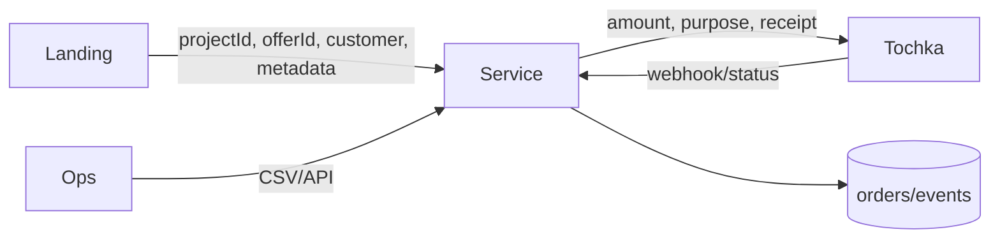

# Сервис платежных ссылок

Черновик v1.  
Один маленький сервис для персональных ссылок Точки из разных лендингов.

## Суть

Лендос не доверяем.  
Цена и платежные параметры живут только в сервисе.



## В v1

- Создать checkout.
- Создать персональную платежную ссылку в Точке.
- Сохранить `email/tg -> order -> paymentLinkId`.
- Принять webhook от Точки.
- Проверить сумму/валюту.
- Вызвать настроенный webhook после `order.paid`.
- Уметь отправить сообщение в Telegram-чат по id.
- Дать CSV/API список заказов.

Не делаем:

- CRM.
- Админку офферов.
- Автовыдачу доступа.
- Промокоды.
- Подписки.
- Возвраты.
- Мультипровайдера.

## Конфиг в коде

Офферы в коде. Захотели поменять цену — PR/deploy.

```ts
export const paymentConfig = {
  projects: {
    aiforwork: {
      enabled: true,
      allowedOrigins: ["https://aiforwork.courses"],
      provider: {
        type: "tochka",
        customerCodeEnv: "TOCHKA_AIFORWORK_CUSTOMER_CODE",
        merchantIdEnv: "TOCHKA_AIFORWORK_MERCHANT_ID",
        apiTokenEnv: "TOCHKA_AIFORWORK_API_TOKEN",
      },
      redirects: {
        successUrl: "https://aiforwork.courses/success",
        failUrl: "https://aiforwork.courses/payment-failed",
      },
      offers: {
        basic_2026_06: {
          enabled: true,
          title: "AI For Work Basic",
          amountMinor: 3400000,
          currency: "RUB",
          purpose: "Оплата участия в курсе AI For Work, тариф Basic",
          paymentModes: ["card", "sbp"],
          ttlMinutes: 10080,
          notifications: {
            onPaid: [
              {
                type: "webhook",
                url: "http://localhost:3000/internal/telegram/send",
                secretEnv: "INTERNAL_NOTIFICATION_TOKEN",
                payload: {
                  chatId: "-1001234567890",
                  template: "order_paid_default",
                },
              },
            ],
          },
          receipt: {
            enabled: true,
            itemName: "Участие в курсе AI For Work",
            vat: "none",
            paymentObject: "service",
            paymentMethod: "full_payment",
          },
        },
      },
    },
  },
} as const;
```

Валидация на старте:

- env secrets есть;
- активные офферы имеют `amountMinor > 0`;
- чек не конфликтует с суммой;
- redirect URL валидные HTTPS;
- валюта только `RUB`.

## Контракт лендоса

`POST /v1/checkouts`

Лендос шлёт только это:

```ts
type CreateCheckoutRequest = {
  projectId: string;
  offerId: string;
  customer: {
    email: string;
    telegram?: string;
    name?: string;
    phone?: string;
  };
  metadata?: Record<string, string>;
};
```

Пример:

```json
{
  "projectId": "aiforwork",
  "offerId": "basic_2026_06",
  "customer": {
    "email": "user@example.com",
    "telegram": "@username"
  },
  "metadata": {
    "utm_source": "telegram"
  }
}
```

Ответ:

```ts
type CreateCheckoutResponse = {
  checkoutId: string;
  orderId: string;
  status: "payment_link_created";
  paymentUrl: string;
  expiresAt?: string;
};
```

Запрещено принимать от клиента:

- `amount`
- `currency`
- `purpose`
- `receipt`
- `redirectUrl`
- provider credentials

Если пришло — `400 request.unexpected_payment_field`.

## Контракт Точки

Сервис сам строит payload для Точки из конфига и customer.

Передаем в Точку:

- `amount`
- `customerCode`
- `merchantId`
- `purpose`
- `paymentMode`
- `paymentLinkId`
- `redirectUrl`
- `failRedirectUrl`
- `ttl`
- `Client.Email`, если чек включен
- `Client.phone/name`, если есть
- `Items`, если чек включен

Не передаем:

- Telegram
- UTM
- internal metadata
- CRM status

Telegram нужен нам, не Точке.

## Контракт webhook от Точки

`POST /v1/webhooks/tochka`

Raw event приводим к нормальному виду:

```ts
type NormalizedTochkaPaymentEvent = {
  provider: "tochka";
  providerPaymentLinkId: string;
  providerOperationId?: string;
  status: "CREATED" | "AUTHORIZED" | "APPROVED" | "EXPIRED" | "REFUNDED" | "DECLINED";
  amountMinor: number;
  currency: "RUB";
  paidAt?: string;
  raw: unknown;
};
```

Путь webhook:

1. Проверить подпись/JWT.
2. Сохранить raw event.
3. Найти order по `providerPaymentLinkId`.
4. Проверить amount/currency.
5. Обновить статус.

Маппинг статусов:

```text
APPROVED  -> paid
EXPIRED   -> expired
REFUNDED  -> refunded
DECLINED  -> failed
CREATED   -> payment_link_created
AUTHORIZED -> requires_manual_review
```

Несовпадение amount/currency = `requires_manual_review`. Не `paid`.

## Исходящие уведомления

После `order.paid` сервис вызывает настроенные webhooks.

Главное правило: ошибка уведомления не меняет статус оплаты.  
Оплата уже `paid`. Ошибка уведомления видна в logs/events.

Единый путь: все уведомления только через webhook targets.  
Даже Telegram вызываем через локальный webhook endpoint.

Конфиг:

```ts
type PaidNotificationTarget = {
  type: "webhook";
  url: string;
  secretEnv?: string;
  payload?: Record<string, string>;
};
```

Payload:

```ts
type OrderPaidWebhookPayload = {
  event: "order.paid";
  order: {
    id: string;
    projectId: string;
    offerId: string;
    amountMinor: number;
    currency: "RUB";
    customerEmail: string;
    customerTelegram?: string;
    paidAt: string;
  };
};
```

Auth:

- Если `secretEnv` есть, шлём `Authorization: Bearer <secret>`.
- Получатель должен отвергнуть пустой/неверный secret.

Без сложных retry в v1.  
Если понадобится позже: добавить таблицу `notification_deliveries` и явную команду retry.

## Telegram receiver

Встроенный endpoint. Webhook caller вызывает его как любой другой target.  
Прямого `type: "telegram"` в конфиге проекта нет.

`POST /internal/telegram/send`

Auth обязателен.

Запрос:

```ts
type TelegramSendRequest = {
  chatId: string;
  text: string;
  parseMode?: "MarkdownV2" | "HTML";
};
```

Для `order.paid` webhook caller шлёт payload события + payload цели:

```ts
type TelegramOrderPaidRequest = OrderPaidWebhookPayload & {
  chatId: string;
  template: "order_paid_default";
};
```

Telegram bot token не лежит в webhook config.  
Endpoint читает его из `TELEGRAM_BOT_TOKEN`.

Пример сообщения:

```text
Новая оплата
Проект: aiforwork
Оффер: basic_2026_06
Email: user@example.com
TG: @username
Сумма: 34000 RUB
```

Это норм: механизм остаётся универсальным.

```mermaid
flowchart LR
  Paid[order.paid] --> Caller[Webhook caller]
  Caller --> LocalTelegram[/internal/telegram/send]
  Caller --> External[Make/n8n/other service]
```

## Хранилище

Две таблицы достаточно.

`orders`:

```ts
type Order = {
  id: string;
  checkoutId: string;
  projectId: string;
  offerId: string;
  status: OrderStatus;
  amountMinor: number;
  currency: "RUB";
  purpose: string;
  offerSnapshot: unknown;
  customerEmail: string;
  customerTelegram?: string;
  customerName?: string;
  customerPhone?: string;
  metadata: Record<string, string>;
  providerPaymentLinkId?: string;
  providerOperationId?: string;
  paymentUrl?: string;
  createdAt: string;
  paidAt?: string;
};
```

`provider_events`:

```ts
type ProviderEvent = {
  id: string;
  provider: "tochka";
  orderId?: string;
  providerPaymentLinkId?: string;
  status?: string;
  amountMinor?: number;
  currency?: string;
  signatureValid: boolean;
  payload: unknown;
  receivedAt: string;
};
```

Опционально позже, только если нужны retry:

```ts
type NotificationDelivery = {
  id: string;
  orderId: string;
  event: "order.paid";
  targetUrl: string;
  status: "delivered" | "failed";
  statusCode?: number;
  error?: string;
  createdAt: string;
  deliveredAt?: string;
};
```

Статусы:

```ts
type OrderStatus =
  | "created"
  | "payment_link_created"
  | "paid"
  | "failed"
  | "expired"
  | "refunded"
  | "requires_manual_review";
```

## Операционка

UI в v1 не делаем.

`GET /ops/orders`  
`GET /ops/orders.csv`

Auth обязателен.

CSV columns:

```text
created_at,paid_at,project_id,offer_id,order_id,status,amount_minor,email,telegram,name,phone,payment_url,provider_payment_link_id
```

## Правила ошибок

- Неизвестный project/offer: fail.
- Выключенный offer: fail.
- Плохой email: fail.
- Сломанный config: сервис не стартует.
- Точка не создала ссылку: `502`, заказ не оплачен.
- Невалидная подпись webhook: `401`.
- Неизвестный webhook payment: сохранить event, вернуть `202`.
- Дубль webhook: no-op.
- Несовпадение суммы: `requires_manual_review`.
- Ошибка уведомления: order остаётся `paid`, ошибка видна.

Без hidden fallback. Не угадываем цену. Не принимаем сумму с клиента.

## Безопасность

- Токены Точки только в env.
- Telegram bot token только в env.
- Internal notification token только в env.
- CORS allowlist per project.
- Ops endpoints закрыты token/access control.
- Internal notification endpoints закрыты bearer token.
- Подпись webhook обязательна.
- Rate limit на checkout.
- Metadata size limit.
- Не логируем tokens/auth headers.
- PII храним только потому, что нужно для операционки: email, tg, phone/name.

## Стек

Фиксировано:

- Чистый Bun.
- Postgres.
- Docker Compose.
- No Node/npm/yarn.
- Изменения конфига через git deploy.

Сервисы compose:

- `app`: HTTP service на Bun.
- `postgres`: хранилище orders/events.
- optional `migrate`: одноразовый migration runner.

## Минимальные тесты

- Отвергаем client `amount/purpose/receipt`.
- Создаём checkout с суммой из config.
- Отвергаем unknown/disabled offer.
- Требуем valid email.
- Падаем на старте при bad config.
- Требуем подпись webhook.
- Paid webhook ставит `paid`.
- Amount mismatch ставит `requires_manual_review`.
- Duplicate webhook идемпотентен.
- `order.paid` вызывает configured webhook.
- Telegram endpoint отвергает missing/wrong auth.
