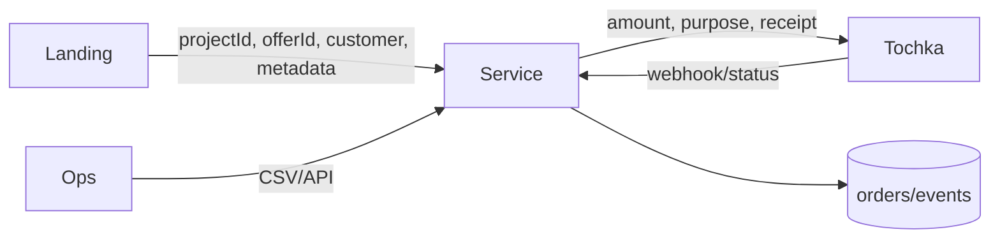

# Сервис платежных ссылок

Черновик v1.  
Один маленький сервис для персональных ссылок Точки из разных лендингов.

Код: [github.com/toolittlecakes/payment-service](https://github.com/toolittlecakes/payment-service) (private).

## Суть

Лендос не доверяем.  
Цена и платежные параметры живут только в сервисе.



## В v1

- Создать checkout.
- Создать персональную платежную ссылку в Точке.
- Сохранить `email/tg -> order -> paymentLinkId`.
- Принять webhook от Точки.
- Проверить сумму/валюту.
- Показать страницу доступа после оплаты (return-handler).
- Выполнить настроенные onPaid-действия после `order.paid`.
- Уметь отправить сообщение в Telegram-чат по id.
- Дать CSV/API список заказов.

Не делаем:

- CRM.
- Админку офферов.
- ~~Email-доставку доступа~~ (сделано: onPaid-действие `email` через Resend, домен aiforwork.courses верифицирован).
- Промокоды.
- Подписки.
- Возвраты.
- Мультипровайдера.

## Конфиг в коде

Офферы в коде. Захотели поменять цену — PR/deploy.

```ts
export const paymentConfig = {
  projects: {
    aiforwork: {
      enabled: true,
      allowedOrigins: ["https://aiforwork.courses"],
      provider: {
        type: "tochka",
        customerCodeEnv: "TOCHKA_AIFORWORK_CUSTOMER_CODE",
        merchantIdEnv: "TOCHKA_AIFORWORK_MERCHANT_ID",
        apiTokenEnv: "TOCHKA_AIFORWORK_API_TOKEN",
      },
      redirects: {
        failUrl: "https://aiforwork.courses/payment-failed",
      },
      offers: {
        basic_2026_06: {
          enabled: true,
          title: "AI For Work Basic",
          amountMinor: 3400000,
          currency: "RUB",
          purpose: "Оплата участия в курсе AI For Work, тариф Basic",
          paymentModes: ["card", "sbp"],
          ttlMinutes: 10080,
          access: {
            html: "<h1>Оплата прошла</h1><p>Чат курса: https://t.me/+XXXX</p>",
          },
          onPaid: [
            {
              type: "webhook",
              url: "http://localhost:3000/internal/telegram/send",
              secretEnv: "INTERNAL_NOTIFICATION_TOKEN",
              payload: {
                chatId: "-1001234567890",
                template: "order_paid_default",
              },
            },
          ],
          receipt: {
            enabled: true,
            itemName: "Участие в курсе AI For Work",
            vat: "none",
            paymentObject: "service",
            paymentMethod: "full_payment",
          },
        },
      },
    },
  },
} as const;
```

Валидация на старте:

- env secrets есть;
- активные офферы имеют `amountMinor > 0`;
- чек не конфликтует с суммой;
- redirect URL валидные HTTPS;
- валюта только `RUB`.

## Контракт лендоса

`POST /v1/checkouts`

Лендос шлёт только это:

```ts
type CreateCheckoutRequest = {
  projectId: string;
  offerId: string;
  customer: {
    email: string;
    telegram?: string;
    name?: string;
    phone?: string;
  };
  metadata?: Record<string, string>;
};
```

Пример:

```json
{
  "projectId": "aiforwork",
  "offerId": "basic_2026_06",
  "customer": {
    "email": "user@example.com",
    "telegram": "@username"
  },
  "metadata": {
    "utm_source": "telegram"
  }
}
```

Ответ:

```ts
type CreateCheckoutResponse = {
  checkoutId: string;
  orderId: string;
  status: "payment_link_created";
  paymentUrl: string;
  expiresAt?: string;
};
```

Запрещено принимать от клиента:

- `amount`
- `currency`
- `purpose`
- `receipt`
- `redirectUrl`
- provider credentials

Если пришло — `400 request.unexpected_payment_field`.

## Контракт Точки

Сервис сам строит payload для Точки из конфига и customer.

Факты из доки (developers.tochka.com, база `https://enter.tochka.com/uapi`):

- Endpoint: `POST /acquiring/v1.0/payments/with-receipt` (чек включён) или `/acquiring/v1.0/payments`.
- Auth: долгоживущий JWT из ЛК (Сервисы -> Интеграции и API), `Authorization: Bearer`. Permissions: `MakeAcquiringOperation`, `ReadAcquiringData`, `ReadCustomerData`, `ManageWebhookData`.
- `paymentLinkId` передаём свой = `orderId` (уникальность обязательна, дубль = ошибка).
- `ttl` в минутах (1–44640, default 10080 = 7 дней). После открытия ссылки у покупателя 1 час на оплату.
- Для чека `Client.email` обязателен; `Items[].vatType: "none"`, `paymentMethod: "full_payment"`, `paymentObject: "service"`.

Передаем в Точку:

- `amount`
- `customerCode`
- `merchantId`
- `purpose`
- `paymentMode`
- `paymentLinkId`
- `redirectUrl` и `failRedirectUrl` — оба ведут на return-handler сервиса (`/v1/checkouts/:id/return`), не на лендинг
- `ttl`
- `Client.Email`, если чек включен
- `Client.phone/name`, если есть
- `Items`, если чек включен

Не передаем:

- Telegram
- UTM
- internal metadata
- CRM status

Telegram нужен нам, не Точке.

## Контракт webhook от Точки

`POST /v1/webhooks/tochka`

Raw event приводим к нормальному виду:

```ts
type NormalizedTochkaPaymentEvent = {
  provider: "tochka";
  providerPaymentLinkId: string;
  providerOperationId?: string;
  status:
    | "CREATED"
    | "AUTHORIZED"
    | "APPROVED"
    | "ON-REFUND"
    | "REFUNDED"
    | "REFUNDED_PARTIALLY"
    | "EXPIRED"
    | "WAIT_FULL_PAYMENT";
  amountMinor: number;
  currency: "RUB";
  paidAt?: string;
  raw: unknown;
};
```

Формат webhook Точки:

- Тело — JWT-строка (RS256, `Content-Type: text/plain`). Подпись проверяем публичным ключом Точки: `https://enter.tochka.com/doc/openapi/static/keys/public`.
- Событие: `acquiringInternetPayment`. Настраивается через API: `PUT /webhook/v1.0/{client_id}`; тестовая отправка — `POST .../test_send`.
- Ретраи Точки: 30 повторов с интервалом 10 сек, только HTTPS 443.

Путь webhook:

1. Проверить JWT-подпись публичным ключом Точки.
2. Сохранить raw event.
3. Найти order по `providerPaymentLinkId`.
4. Проверить amount/currency.
5. Обновить статус.

Маппинг статусов:

```text
APPROVED  -> paid
EXPIRED   -> expired
REFUNDED  -> refunded
CREATED   -> payment_link_created
всё остальное (AUTHORIZED, ON-REFUND, REFUNDED_PARTIALLY, WAIT_FULL_PAYMENT) -> requires_manual_review
```

Статуса `DECLINED` у Точки нет: неудачная попытка оплаты не меняет статус ссылки, провал фиксируется только истечением (`EXPIRED`).

Несовпадение amount/currency = `requires_manual_review`. Не `paid`.

## Страница доступа

`GET /v1/checkouts/:id/return`

Юзер возвращается из Точки сюда. Сервис проверяет статус платежа напрямую в API Точки и:

- `paid` — рендерит HTML доступа из `offer.access.html`, ставит `accessViewedAt`;
- `expired/refunded` — 302 на `redirects.failUrl` проекта;
- ещё обрабатывается — страница «оплата обрабатывается, обновите через минуту».

Правила:

- Доступ защищён самим `checkoutId`: случайный непубличный id, есть только в браузере оплатившего.
- Страница идемпотентна: открывается повторно сколько угодно раз, статус каждый раз проверяется в Точке.
- Форма доступа не захардкожена: контент — per-offer HTML в конфиге. Приватность TG-чата решается на стороне Telegram (инвайт с заявками на вступление), не сервиса.

Риск: юзер оплатил, но не вернулся со страницы Точки (закрыл вкладку). Оплату поймает webhook, но страницу доступа он не увидит. В v1 такие заказы видны в ops (`paid` без `accessViewedAt`) — доступ досылаем руками. В v2 — email-бэкап через onPaid-действие.

## Действия после оплаты (onPaid)

После перехода `* -> paid` сервис выполняет список `onPaid` действий оффера. Ровно один раз: дубль webhook'а Точки действия не перезапускает.

Главное правило: ошибка действия не меняет статус оплаты.  
Оплата уже `paid`. Ошибка действия видна в logs/events.

Единый путь: все уведомления только через webhook targets.  
Даже Telegram вызываем через локальный webhook endpoint.

Конфиг:

```ts
type PaidAction =
  | {
      type: "webhook";
      url: string;
      secretEnv?: string;
      payload?: Record<string, string>;
    }
  // v2: письмо покупателю по шаблону (email-бэкап доступа). Провайдер: Resend.
  | { type: "email"; templateId: string };
```

## Email: Resend, ручная настройка

Делается один раз при настройке сервиса, до реализации `type: "email"`.

1. Аккаунт на resend.com (free tier: 3000 писем/мес) → Add Domain.
2. Домен отправки — поддомен `send.aiforwork.courses`: если репутация испортится, основной домен не пострадает. From: `hello@send.aiforwork.courses`, Reply-To — любой основной адрес.
3. DNS-записи из панели Resend добавить у DNS-провайдера: SPF (TXT), DKIM (TXT), опционально MX для bounce. Плюс DMARC вручную: TXT `_dmarc.send.aiforwork.courses` = `v=DMARC1; p=none`.
4. Дождаться верификации домена в панели (минуты).
5. API key → env `RESEND_API_KEY`. Отправка — один вызов:

```ts
await fetch("https://api.resend.com/emails", {
  method: "POST",
  headers: { Authorization: `Bearer ${key}`, "Content-Type": "application/json" },
  body: JSON.stringify({ from, to, subject, html }),
});
```

Проверка перед запуском:

- Тестовые письма на ящики @mail.ru и @yandex.ru — смотрим, не спам ли. Mail.ru строже всех к новым зарубежным отправителям.
- Если Mail.ru заворачивает — зарегистрировать домен в postmaster.mail.ru (бесплатный мониторинг репутации).

Payload:

```ts
type OrderPaidWebhookPayload = {
  event: "order.paid";
  order: {
    id: string;
    projectId: string;
    offerId: string;
    amountMinor: number;
    currency: "RUB";
    customerEmail: string;
    customerTelegram?: string;
    paidAt: string;
  };
};
```

Auth:

- Если `secretEnv` есть, шлём `Authorization: Bearer <secret>`.
- Получатель должен отвергнуть пустой/неверный secret.

Без сложных retry в v1.  
Если понадобится позже: добавить таблицу `notification_deliveries` и явную команду retry.

## Telegram receiver

Встроенный endpoint. Webhook caller вызывает его как любой другой target.  
Прямого `type: "telegram"` в конфиге проекта нет.

`POST /internal/telegram/send`

Auth обязателен.

Запрос:

```ts
type TelegramSendRequest = {
  chatId: string;
  text: string;
  parseMode?: "MarkdownV2" | "HTML";
};
```

Для `order.paid` webhook caller шлёт payload события + payload цели:

```ts
type TelegramOrderPaidRequest = OrderPaidWebhookPayload & {
  chatId: string;
  template: "order_paid_default";
};
```

Telegram bot token не лежит в webhook config.  
Endpoint читает его из `TELEGRAM_BOT_TOKEN`.

Пример сообщения:

```text
Новая оплата
Проект: aiforwork
Оффер: basic_2026_06
Email: user@example.com
TG: @username
Сумма: 34000 RUB
```

Это норм: механизм остаётся универсальным.

```mermaid
flowchart LR
  Paid[order.paid] --> Caller[Webhook caller]
  Caller --> LocalTelegram[/internal/telegram/send]
  Caller --> External[Make/n8n/other service]
```

## Хранилище

Две таблицы достаточно.

`orders`:

```ts
type Order = {
  id: string;
  checkoutId: string;
  projectId: string;
  offerId: string;
  status: OrderStatus;
  amountMinor: number;
  currency: "RUB";
  purpose: string;
  offerSnapshot: unknown;
  customerEmail: string;
  customerTelegram?: string;
  customerName?: string;
  customerPhone?: string;
  metadata: Record<string, string>;
  providerPaymentLinkId?: string;
  providerOperationId?: string;
  paymentUrl?: string;
  createdAt: string;
  paidAt?: string;
  accessViewedAt?: string;
};
```

`provider_events`:

```ts
type ProviderEvent = {
  id: string;
  provider: "tochka";
  orderId?: string;
  providerPaymentLinkId?: string;
  status?: string;
  amountMinor?: number;
  currency?: string;
  signatureValid: boolean;
  payload: unknown;
  receivedAt: string;
};
```

Опционально позже, только если нужны retry:

```ts
type NotificationDelivery = {
  id: string;
  orderId: string;
  event: "order.paid";
  targetUrl: string;
  status: "delivered" | "failed";
  statusCode?: number;
  error?: string;
  createdAt: string;
  deliveredAt?: string;
};
```

Статусы:

```ts
type OrderStatus =
  | "created"
  | "payment_link_created"
  | "paid"
  | "expired"
  | "refunded"
  | "requires_manual_review";
```

## Операционка

UI в v1 не делаем.

`GET /ops/orders`  
`GET /ops/orders.csv`

Auth обязателен.

CSV columns:

```text
created_at,paid_at,project_id,offer_id,order_id,status,amount_minor,email,telegram,name,phone,payment_url,provider_payment_link_id,access_viewed_at
```

## Правила ошибок

- Неизвестный project/offer: fail.
- Выключенный offer: fail.
- Плохой email: fail.
- Сломанный config: сервис не стартует.
- Точка не создала ссылку: `502`, заказ не оплачен.
- Невалидная подпись webhook: `401`.
- Неизвестный webhook payment: сохранить event, вернуть `202`.
- Дубль webhook: no-op.
- Return по неизвестному checkoutId: `404`.
- Несовпадение суммы: `requires_manual_review`.
- Ошибка уведомления: order остаётся `paid`, ошибка видна.

Без hidden fallback. Не угадываем цену. Не принимаем сумму с клиента.

## Безопасность

- Токены Точки только в env.
- Telegram bot token только в env.
- Internal notification token только в env.
- CORS allowlist per project.
- Ops endpoints закрыты token/access control.
- Internal notification endpoints закрыты bearer token.
- Подпись webhook обязательна.
- Rate limit на checkout.
- Metadata size limit.
- Не логируем tokens/auth headers.
- PII храним только потому, что нужно для операционки: email, tg, phone/name.

## Точка: ручная настройка

Делается один раз, до запуска сервиса.

1. [x] Подключить интернет-эквайринг: заявка подана 30.07.2026 (акция: карты 1% / СБП 0% до оборота 300 000 ₽/мес, дальше 1,8%/0,4%; акция до 31.12.2026). Магазин: «AI For Work» / `AIFORWORK.COURSES`, вид деятельности «Образование», сайт aiforwork.courses.
2. [x] Фискализация: выбран сервис «Чеки» (+1,5% от суммы, касса не нужна). Ограничение оферты: услуга должна оказываться не позже приёма платежа — доступ выдаём сразу после оплаты, формулировки офферов держим в духе «доступ с момента оплаты».
3. Создать JWT-ключ: ЛК -> Сервисы -> Интеграции и API -> Создать JWT-ключ, permissions: `MakeAcquiringOperation`, `ReadAcquiringData`, `ReadCustomerData`, `ManageWebhookData`. Токен -> env, `client_id` записать.
4. Получить `customerCode` (Get Customers List) и `merchantId` (Get Retailers, `status: REG`, `isActive: true`) -> env.
5. Настроить вебхук: `PUT /webhook/v1.0/{client_id}` на `https://<pay-domain>/v1/webhooks/tochka`, событие `acquiringInternetPayment`. Проверить через `test_send`.
6. ВАЖНО: перевыпуск JWT меняет `client_id` — после перевыпуска вебхук привязывается заново (шаг 5).

Тестирование: песочница Точки не эмулирует оплату (захардкоженные ответы, тестовых карт нет). Интеграция проверяется на проде: платёж 1 ₽ по реальной ссылке -> проверка вебхука и страницы доступа -> возврат.

## Стек

Фиксировано:

- Чистый Bun.
- Postgres.
- Docker Compose.
- No Node/npm/yarn.
- Изменения конфига через git deploy.
- Деплой: VPS `racknerd-2` (при проблемах — Selectel/cloud.ru).
- Домен: `pay.aiforwork.courses` -> 23.94.86.204 (A-запись в Namecheap создана, Caddy vhost с TLS настроен, отвечает заглушкой; при деплое заменить `respond` на `reverse_proxy 127.0.0.1:<port>` в /etc/caddy/Caddyfile).

Сервисы compose:

- `app`: HTTP service на Bun.
- `postgres`: хранилище orders/events.
- optional `migrate`: одноразовый migration runner.

## Минимальные тесты

- Отвергаем client `amount/purpose/receipt`.
- Создаём checkout с суммой из config.
- Отвергаем unknown/disabled offer.
- Требуем valid email.
- Падаем на старте при bad config.
- Требуем подпись webhook.
- Paid webhook ставит `paid`.
- Amount mismatch ставит `requires_manual_review`.
- Duplicate webhook идемпотентен.
- `order.paid` вызывает configured webhook, действия выполняются один раз.
- Return-handler рендерит доступ только при `paid` в Точке.
- Return-handler идемпотентен: повторное открытие снова отдаёт доступ.
- Telegram endpoint отвергает missing/wrong auth.
